# Geehy G32R430 Tiny Board Eval

## 硬件参数和官方SDK
- Arm® Cortex®-M52 32位内核
- 全温全压下最高128MHz工作频率
- 内置硬件TMU：支持ATAN运算 
- 支持ITCM/DTCM扩展
- Flash：容量最高为128KB
- TCM（Tightly Coupled Memory）：其中16KB DTCM，32KB ITCM
  - 比RAM快
- 2个USART，最大传输速率16Msps，支持RS485的发送使能IO自动控制 （√）
- 1个I2C，最高支持400kHz（√）
- 1个SPI，主从模式的最大传输速率50Mbit/s （√）
- 2个16位ADC，支持规则序列、注入序列、单次、连续采样模式，支持主从模式，配置主从时保持采样同步，多达6对差分/12个单端采样通道 
- 1个12位的ADC，最多支持14个外部通道和2个内部通道
- 2个10位DAC，DAC输出可配置为比较器输入 
- 1个温度传感器 （√）
- 4个可编程模拟比较器（COMP）
- 1个16位高级定时器，最多有4个互补通道，支持输入捕获、输出比较、刹车、死区、PWM与脉冲计数等功能 （√）
- 3个16位通用定时器，每个定时器最多有4个独立通道，支持输入捕获、输出比较、PWM与脉冲计数等功能 （√）
- 1个16位低功耗定时器
- 2 个看门狗定时器：一个独立看门狗IWDT和一个窗口看门狗WWDT 

注：带有（√）的是本次评测的模块。主要针对`IIC`, `SPI`, `UART`, `TMR`进行了测试，测试语言为`Rust`。测试结果放在了文末，附带所有的测试代码的仓库链接。

首先，十分感谢`极海半导体`提供的开发板用于本次评测，顺便夸一下包装，搞得不丑。


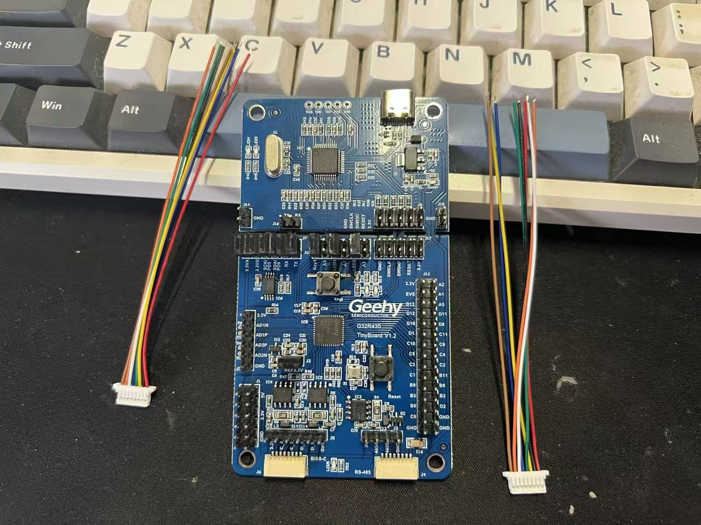


官方提供了十分详细的资料供入选者进行充分评估。
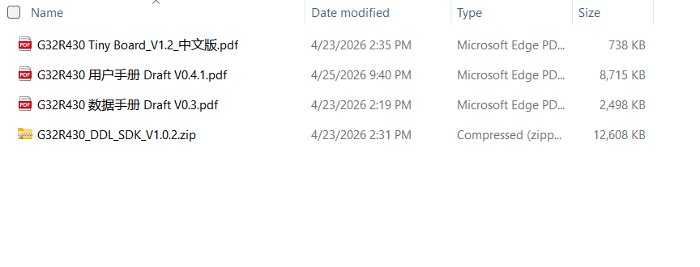
从上到下分别是：
- 开发板原理图
- 用户手册
- 数据手册
- SDK

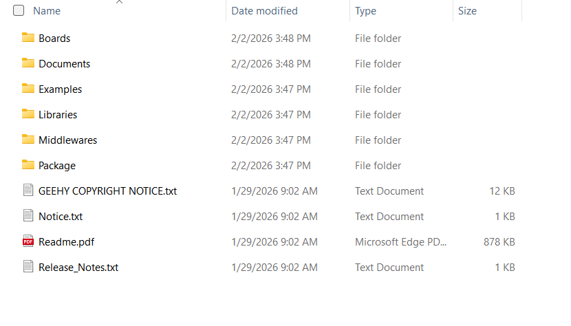
解压SDK文件后得到一些用于开发的资料，粗略看了一下，只要安装了`MDK-ARM V5.43`及更新版本，再安装相应的`Pack`就可以进行“愉快”的开发了。
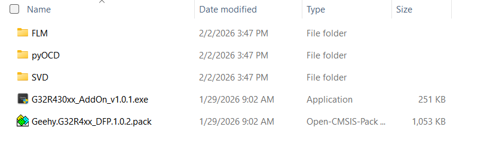
值得好评的是，官方也提供了`pyOCD`和`FLM`。

## 使用`Rust`语言开发`G32R430`

### Why Rust?

- 我最近正在学习`Rust`这门语言，想要通过项目来进行实践；
- `Rust`也能用于嵌入式开发，而且赛道没有`C/C++`这么拥挤；
- 做点别人没做过的，积累经验；
- 给感兴趣的同好提供一些经验；
- 如果只是直接烧录官方固件，草草交差了事的话，似乎不能学到新知识。

### Final Results?
- `SVD`->`PAC`->`HAL`，成功实现了：
  - 点灯：`GPIO`；
  - 点屏：点亮`IIC`屏幕，芯片型号为`SSD1306`, `0.96''`；点亮`SPI`屏幕，芯片型号为`SH1106`, `1.3''`；
  - 定时器：高级定时器的互补输出指定频率，指定占空比的`PWM`波、通用定时器输出指定频率，指定占空比的`PWM`波；
  - 串口：串口收发；
- 对官方资料进行勘误，使其更加标准，更加规范，可以适配多套开发工具链。
- “魔改了”相关工具：`probe-rs`和`target-gen`适配芯片内核：`Arm® Cortex®-M52`。

## 制作`PAC`

使用[`svd2rust`](https://github.com/rust-embedded/svd2rust)工具即可根据`svd`文件生成`PAC`(Periphral Access Crate)，具体的制作方法可以直接看相关文档，或者参考我的博客：https://www.rustopus.com/stm32/svd2rust.html。

期间遇到的问题主要是`G32R430xx.svd`文件的规范性导致的，如果只是直接使用官方的`SDK`进行`C`语言开发，则不需要关注以下问题：

- 高级定时器1的虚空继承：
```xml
<peripheral derivedFrom="">
            <name>TMR1</name>
            <description>Advance timer</description>
            <groupName>TMR</groupName>
            <baseAddress>0x40000000</baseAddress>
```
如果参考`xTM32`的`SVD`文件来看的话，这里的`derivedFrom=""`是多余的，会导致`svd2rust`无法正常识别到这个字段。从兼容多套工具链的角度来说，应该删去`derivedFrom=""`。而且翻阅用户手册和数据手册后发现`TMR1`本身就无需从别的定时器“继承”。所以，应该删去。以下是还未去除时候的报错。

```bash
❯ svd2rust -i G32R430xx.svd -o ./temp
[INFO  svd2rust] Parsing device from SVD file
[INFO  svd2rust] Rendering device
[ERROR svd2rust] Error rendering device
    
    Caused by:
        0: can't render peripheral 'TMR1', group 'TMR', derived from: ''
        1: peripheral  not found
```

- 通用定时器3多余的`registers`字段：
```xml
        <peripheral derivedFrom="TMR2">
            <name>TMR3</name>
            <description>General purpose timer</description>
            <baseAddress>0x40000800</baseAddress>
            <interrupt>
                <name>TMR3</name>
                <description>TMR3 global interrupt</description>
                <value>17</value>
            </interrupt>
            <registers/>
        </peripheral>
```
关于通用定时器3的`registers`字段报错，会出现在`PAC`里：

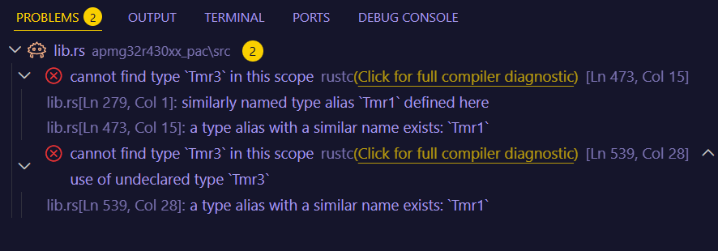

但是同样地位的`TMR4`却不报错，考虑到通用定时器4和3的地位是一样的，这里的描述也应该保持一致，所以这里的`<registers/>`也应该去除。事实证明，删除之后，得到的`PAC`就没有报错了。
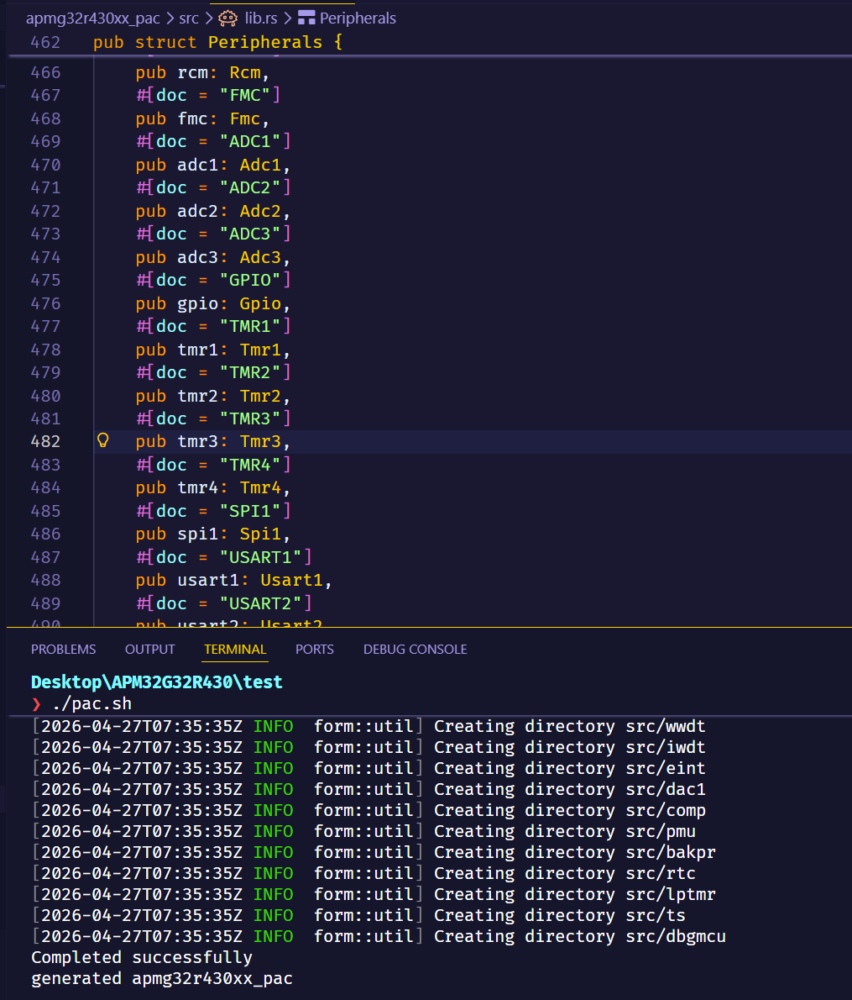
- 高级定时器的英文全称错误：
```xml
<peripheral>
            <name>TMR1</name>
            <description>Advance timer</description>
            <groupName>TMR</groupName>
            <baseAddress>0x40000000</baseAddress>
```
这里的`Advance timer`应该写作`Advanced timer`。

以上是`G32R430xx.svd`文件里存在的不规范行为，建议做以上调整。

## 编写`HAL`

完成以上步骤后，就得到了`PAC`，基于此就已经可以进行固件开发了。但是考虑到代码的复用和生态的对接，需要在`PAC`的基础上，继续封装一层，用于对接`embedded-hal`或者`embassy`。

这一步通常需要参考官方给出的`C`语言版本的`SDK`和`Examples`，考虑到这只是一篇评测文章，就不过多介绍具体的代码编写和适配环节了。

最终的代码已经上传到了[`Github Repo`](https://github.com/linkyourbin/geehy_g32r430_tiny_board_eval)

## 需要进行适配的地方

由于`probe-rs`上游还未适配`G32R430`的烧录算法，所以一切都得自力更生。幸运的是`probe-rs`仓库提供了一个工具用于生成烧录算法，只需要提供`pac`即可。但是坑还是一个接着一个。。。

1. 坑一，`target-gen`不支持`CortexM52`
- 使用`target-gen`生成`xxx.yaml`烧录算法
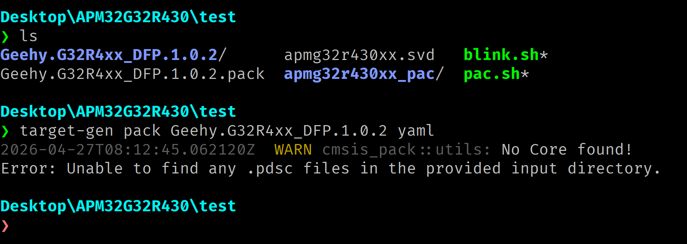
查看`target-gen`的源码后发现：
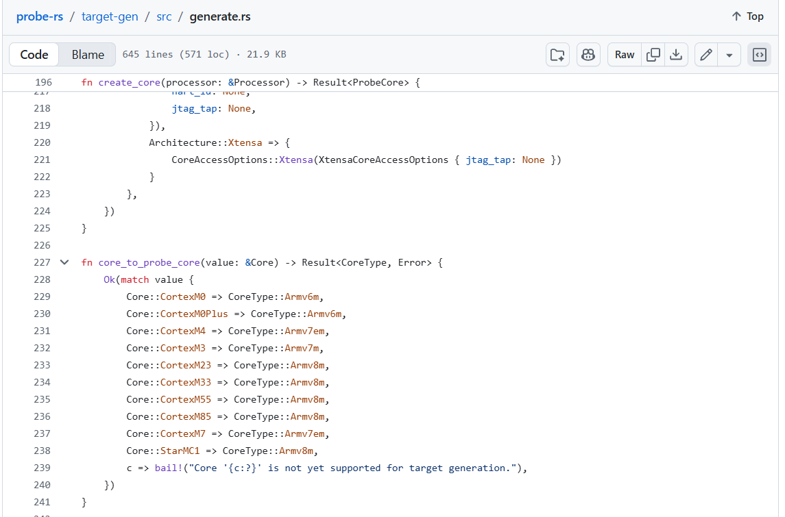
很遗憾，确实没有适配`CortexM52`。

- 针对坑1的补救措施：考虑到`CortexM52`和`CortexM55`都属于`Armv8m`，或许可以直接修改`Geehy.G32R4xx_DFP.pdsc`里的关键值来进行适配。

- 用任意编辑器打开`Geehy.G32R4xx_DFP.pdsc`（由`Geehy.G32R4xx_DFP.1.0.2.pack`解压得到）。

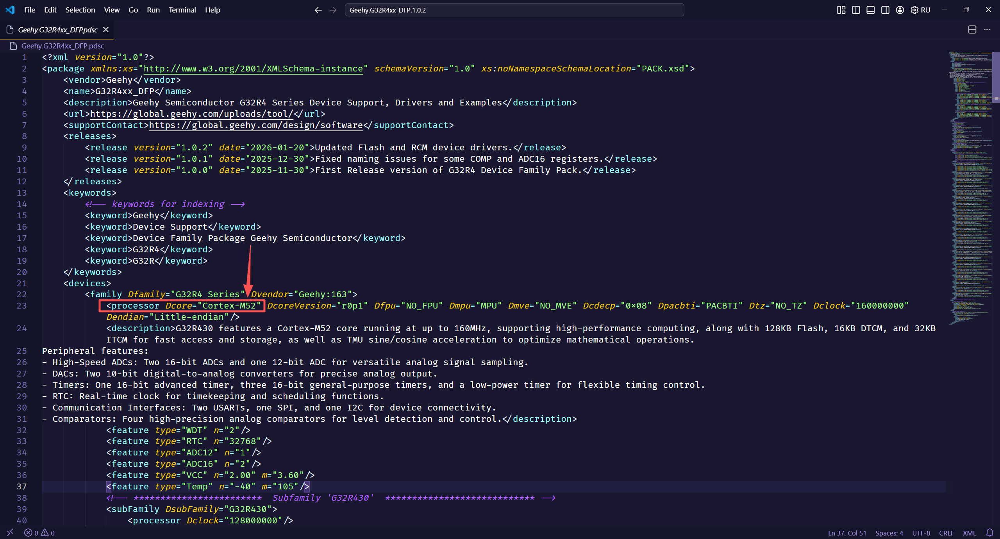

将图中的`Dcore="Cortex-M52"`修改为`Dcore="Cortex-M55"`，再次生成`yaml`烧录文件。
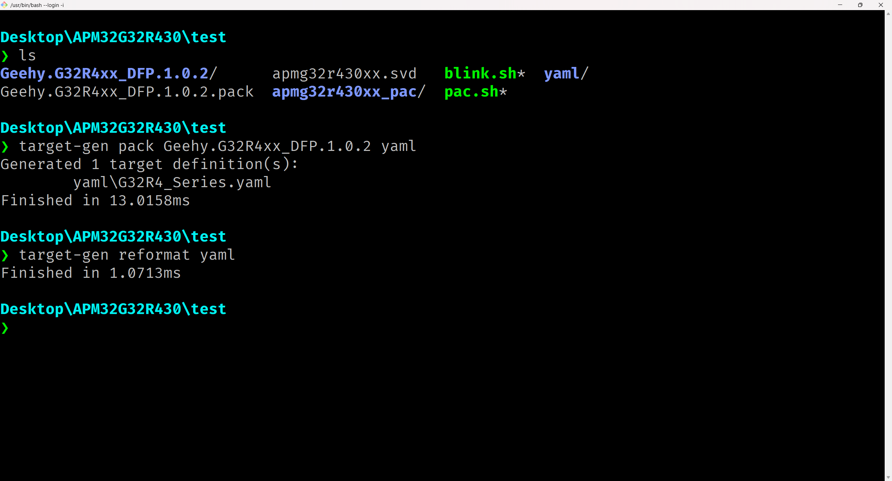
没有报错。

得到的`yaml`目录里存放了`G32R4_Series.yaml`文件。还是不能直接使用，直接烧录的报错（这里用的`probe-rs`是修改过后的，可以正常进行烧录，下文会介绍如何修改。）：
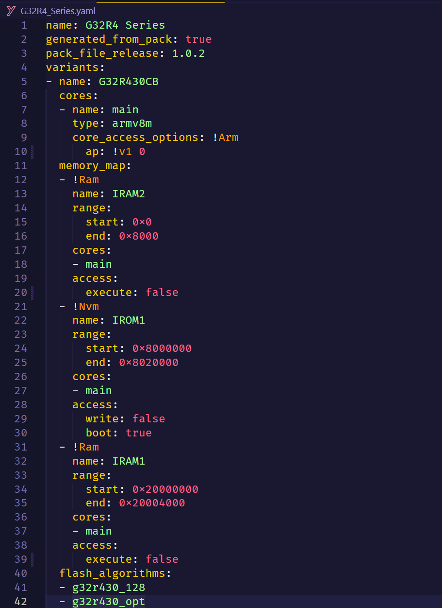
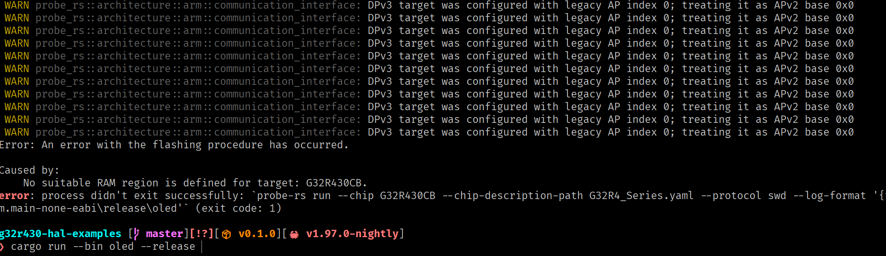

使用`probe-rs`查看。

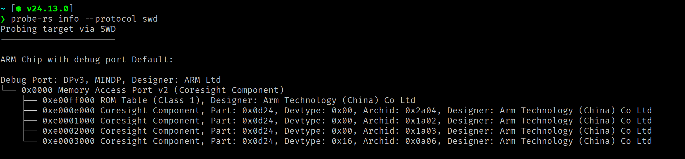

有用的信息是：`Port V2`。

回到`G32R4_Series.yaml`文件，将`!v1 0`改为`!v2 0x0`，继续再将
```yaml
access:
  execute: false
```
改为
```yaml
access:
  execute: true
```
2. 坑2：`probe-rs`烧录还是会报错

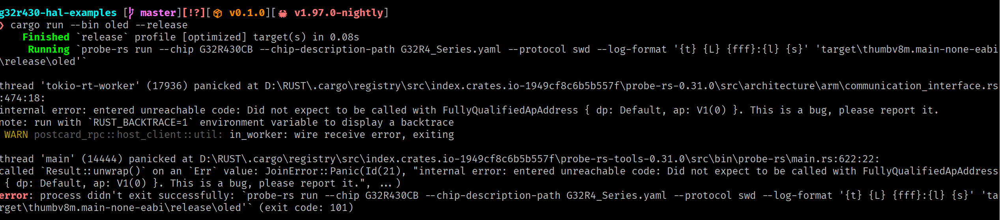

以上的尝试已经解决了相关`yaml`烧录算法，现在存在的问题是官方版本的`probe-rs`无法匹配到`DPv3/AP`。所以需要稍做调整。先将官方的源码`clone`到本地，然后添加以下代码，并且进行本地安装。

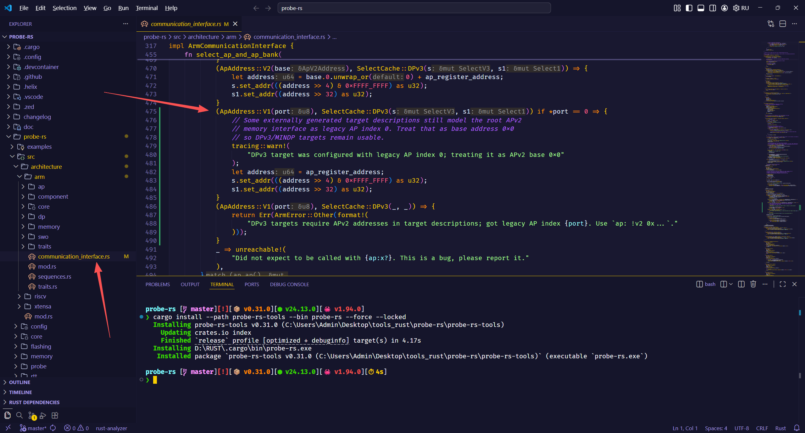

继续测试烧录，已经没有报错，可以正常烧录代码，进行测试。
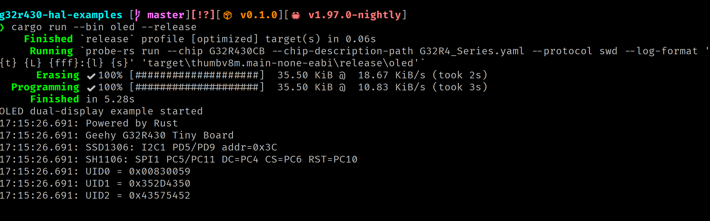

## 测试相关模块
所有测试代码都存放在`src/bin`，由于没有合适的外设模块，`ADC`部分未进行测试。

执行以下命令即可烧录代码到开发板。
```bash
# 同时点亮ssd1306(iic)和sh1106(spi)屏幕
cargo run --bin oled --release
# 使用通用定时器2的通道1在pc4引脚输出pwm波
cargo run --bin pwm_tmr2_ch1_pc4 --release
# 使用高级定时器1在pd1和pd2引脚生成互补pwm波
cargo run --bin tmr1_complementary_pd1_pd2 --release
# usart发送数据
cargo run --bin uart_polling --release
```
以下给出所有测试的结果截图/照片。

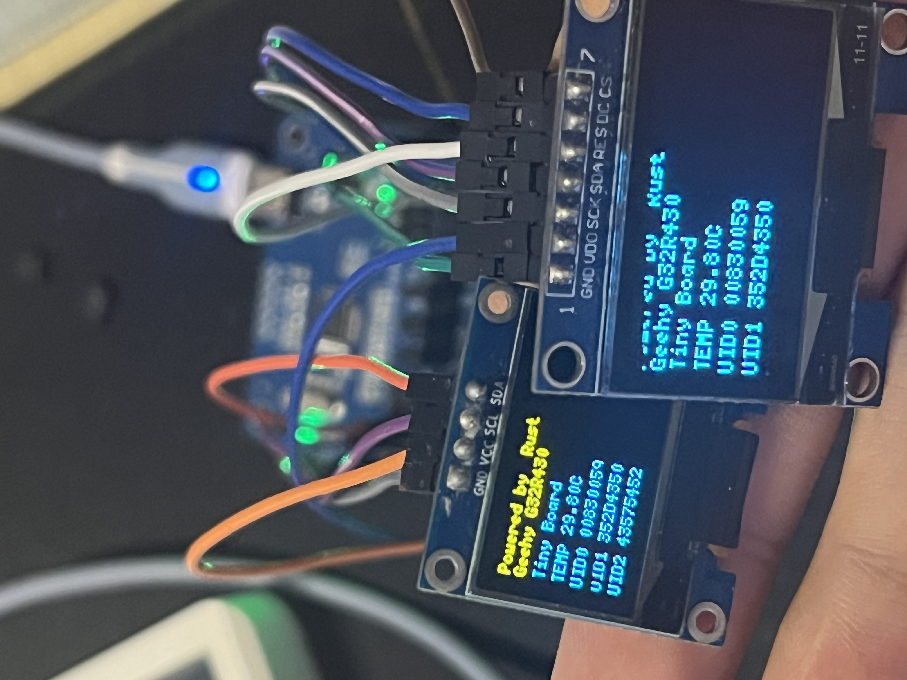
正常显示字符数字，其中`TEMP`是读取了芯片内部的温度传感器得到的值，用手触摸芯片之后，温度会有所上升（常规情况下，人体的温度是可以对芯片进行热传递的。）。`UIDx`部分是读取了芯片的`UID`，并且显示。

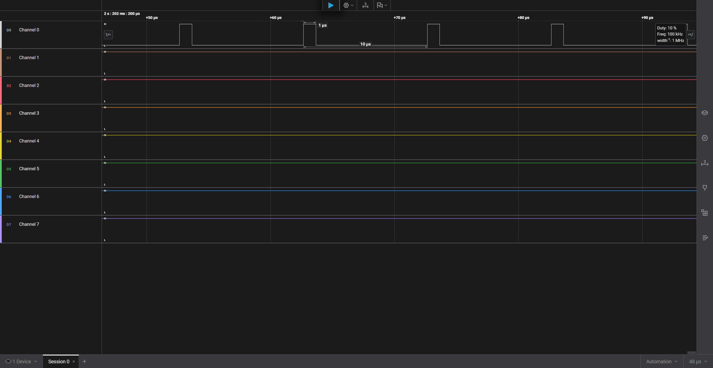

`PC`引脚输出`100KHz`的`PWM`波，占空比为`10%`。

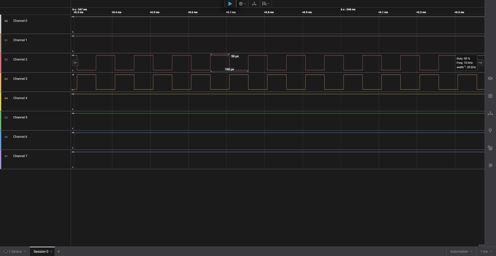
`PD1`和`PD2`引脚输出`10KHz`互补`PWM`波。

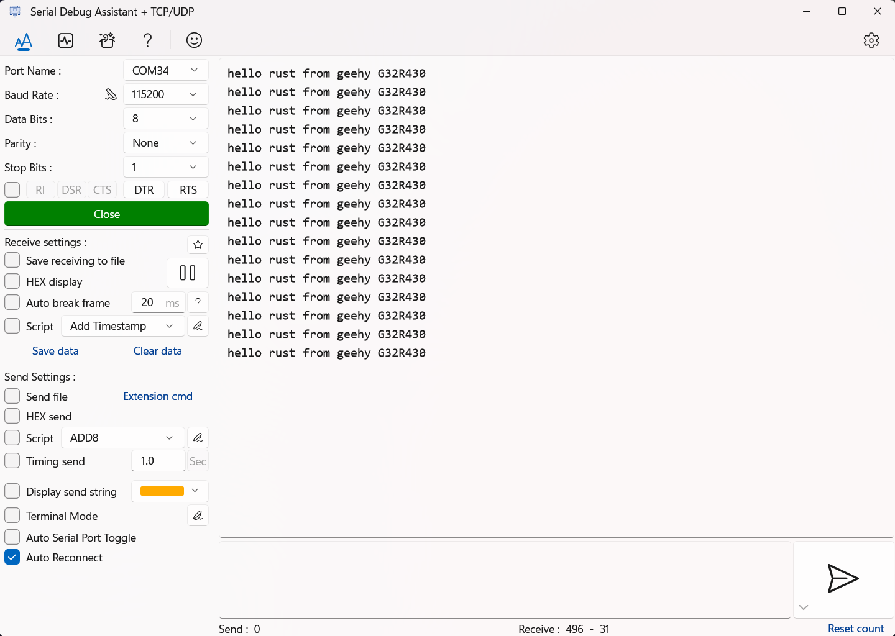
串口助手接收到来自串口的信息。

## 结语

再次感谢极海半导体提供此次测评机会。

此次评测，借助G32R430 Tiny Board完成了`Rust`语言开发国产单片机的任务，虽然踩了一些坑，但也感觉很值得，如果只是烧录官方的固件，也不会学到更多有意思的知识。

由于手里确实没有更多适配这块板子的模块，所以就只测试了当前的这些外设，后续如果能入手相关模块，也会继续更新相关的教程/评测。

## 参考
- https://github.com/probe-rs/probe-rs
- https://github.com/rust-embedded/svd2rust
- https://www.geehy.com/
